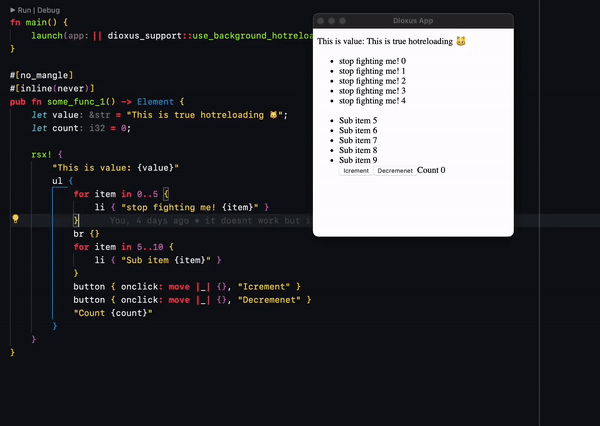

# ipbp.rs - in place binary patching

patch rust functions at runtime with magic and linker hacks.

certainly more limited than Live++.

Doesn't handle all the edge cases. Doesn't care about shared libraries. Probably doesn't work for your usecase.

Targets supported (in order of importance):
- [x] macos
- [ ] wasm
- [ ] linux
- [ ] ios
- [ ] android
- [ ] windows

## what's missing
- [ ] patching of functions not named "some_func_1" 🤣 (hardcoded some things....)
- [ ] intra compilation-unit static/thread local patching (works across crate boundaries, not within crates)
- [ ] generic tooling for any project
- [ ] performance improvements
- [ ] proper object diffing not reliant on symbols
- [ ] reflection system for struct changes
- [ ] unknown impact on vtable and trait objects
- [ ] unloading of swapped changes
- [ ] a proper GOT implementation rather than a psuedo GOT
- [ ] patching of non-nomangle functions
- [ ] support for windows

Currently I've only really tested cross-crate thread locals and statics since that's normally what doesn't work with dylib loader systems. It works with this crate. Tokio and Dioxus use lots of threadlocals - components, tasks, TLS-based runtimes will all work with this.

For intra crate statics/tls, this doesn't work since the object file we load into the running process will bring those symbols in itself. We need to either trim out those symbols before injecting or configure the linker to exclude them somehow. It shouldn't be too hard but there isn't great tooling on mac for this since mach-o isn't really super popular.

Not every program wants its functions truly patched, so we're using a psuedo global-offset-table (or really a jump table) which get wired up via  a `#[hotreload]` attribute. The longer term thinking here is that we *do* directly patch functions but then just signal to the program runtime that we did that so it can do whatever unwinding it needs to do to prevent panics.

For example, this crate doesn't patch currently code in async tasks - depending on implementation details of the future desugaring the future itself might change in such a way that it can't be patched. The runtime would need to unwind this hotreload by dropping the task and restarting it, or just killing it altogether depending on the nature of the task.

There's some performance being left on the table here. A reload takes about 2 seconds which is great but still not super fast. By messing with the default linker settings, cutting out some debug info, and other tricks you can get rust incremental compiles down to half a second. I had to give up on operating on incremental compilation artifacts, but I do think that is the faster long-term solution. Right now we're using `--emit=obj` to give us the well-formed `.o` file that we transform into the `.so` for dylib loading, but I think this is including more symbols than we want. Operating on incremental compilation artifacts would prevent symbol leakage (solving the intra crate TLS issue) and just generally be faster - less code to worry about. I ran into issues with `ADRP` violations presumably since some relocations are malformed.

Hotreloading code itself is only half the battle. The other half is knowing the effects of the change such that the runtime is aware of the changes for unwinding. A better solution overall would be some sort of smart system that can tell the runtime the type of change that happened. Ideally this is generic for any rust project.

Anyways! More tests and more platforms to come.

## how it works

roughly:
- diff object files
- figure out what exactly changed
- combine the changed object files using the dep map
- figure out affected symbols and functions
- package the .o files together into a single cursed dylib that tricks dlopen
- disable a bunch of stuff like ASLR
- dlopen that dylib at the *same address as the program root itself* such that our pic/pie code can work properly
- resovle missing symbols against the *running binary*
- tell the app that we've patched it and it should maybe try to do new stuff

and voila you have in-place binary patching for a running rust app.

Not only does completely circumvent the typical close, rebuild, relink, restart, reinitialize, resume flow, but it uses rust's *incremental compiler* *WITHOUT LINKING* - the only unnecessary cost we pay here is the compiler frontend + macro expansion. This is faster than pretty much anything else you could design.**

** currently uses the linker in a sort of pass-thru mode. we still need to handle compilation-level relocations. eventually will drop this entirely.

## Current status:

We can diff object files and figure out which symbols have changed between revs. This lets us narrow down our patch creation to just the symbols in a few object files.

Todo:
- merge across more codegen units (.o)
- Respect the graph for larger projects (need to parse some random .bin files...)
- Assemble dylib with necessary hacks (missing relocations, etc)
- Dlopen said dylib with zero/limited-exports
- Initial approach will not include debug symbosl for the debugger - this seems much harder than just arbitrarily loading code in

Supposedly rust employs less "magic" making our primary hiccups:
- statics (actually static statics...)
- tls
- vtable

Doing this on mac seems relatively straightforward. Relocations are easy and all symbols are around, thanks to Rust.
Wasm should also be easy in theory, and then Linux too.
Windows scares me.
Android/ios require a networked variant of this which, again, should work in theory.

## Tricks

- use base_address to combat aslr for an already running program
- we dont want to compile to original program *without* alsr

## Notes
- dlopen seems to be working on ios?

https://gitlab.com/turbocooler/dyld-trie
https://crates.io/crates/formatic
https://github.com/Toni-Graphics/Formatic
https://fasterthanli.me/series/making-our-own-executable-packer/part-18

## ummmmmmmmmmmmmmmm

https://stackoverflow.com/questions/495262/linking-symbols-to-fixed-addresses-on-linux

can't we just define the existing symbols - except for the target - from the already resolved symbols in space?
